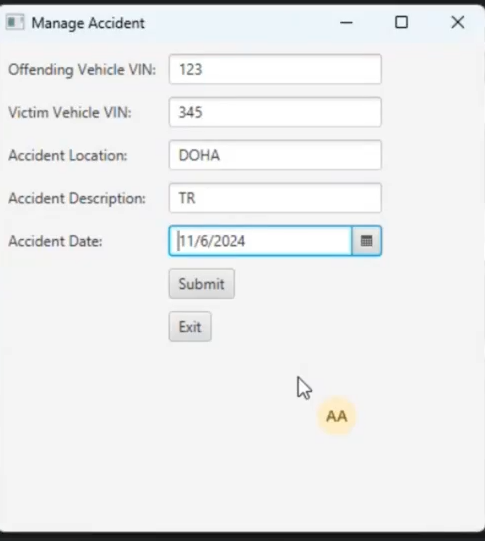
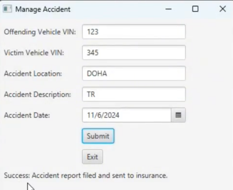

# 🚗 Qatar Vehicle Registration System (QVRS)

> A desktop application that simulates core vehicle registration services in Qatar — including ownership transfers, accident reporting, fine payments, and insurance management. Built with Java and JavaFX following structured software engineering principles.

---

## 🛠️ Tech Stack

| Layer | Technology |
|-------|-----------|
| Language | Java 21 |
| UI Framework | JavaFX + Scene Builder |
| Build Tool | Maven (dependency management & build automation) |
| Diagramming | Visual Paradigm |
| Testing | JUnit |
| Design Patterns | Factory Pattern, Observer Pattern |

---

## 📐 Design Phase

Before writing a single line of code, the full system was designed and documented using **Visual Paradigm**. This ensured a clear understanding of requirements and architecture across the team.

The following diagrams were produced:

- **Level 0 DFD** — High-level overview of data flow between the system and external entities (vehicle owners, qPay, traffic police, insurance)
- **Level 1 DFD** — Breakdown of internal processes such as registration, fine payment, and ownership transfer
- **Use Case Diagram** — Identifies all system actors and their interactions with core functionalities (Register Vehicle, Renew Registration, Transfer Ownership, Pay Fines, Report Accident)
- **Use Case Specifications** — Detailed documentation for each use case covering actors, preconditions, postconditions, normal flow, and alternative flows
- **Class Diagram** — Defines all system entities (Vehicle, Owner, Registration, Fine, Insurance, AccidentReport) with their attributes, methods, and relationships (aggregation, composition, inheritance)
- **Sequence Diagrams** — Step-by-step interaction flows for "Transfer Registered Vehicle" and "Pay Fines and Invoices"

---

## ✨ Features

- **Vehicle Registration** — Register new vehicles and renew existing registrations
- **Ownership Transfer** — Transfer a registered vehicle between owners with validation
- **Accident Reporting** — File accident reports and automatically notify the insurance company
- **Fine & Invoice Payment** — Pay outstanding fines via qPay integration
- **Insurance Management** — Track and manage vehicle insurance policies
- **Fitness Certificate** — Handle vehicle fitness certification workflows

---

## 🏗️ Architecture & Design

The system is built around two core design patterns:

### Factory Pattern
Centralizes vehicle object creation (Car, Truck, etc.) through a `VehicleFactory` class, keeping creation logic independent of client code and making it easy to extend with new vehicle types.

### Observer Pattern
The `VehicleRegistration` module notifies all registered stakeholders (Traffic Police, Insurance Companies) automatically when registration status changes — keeping components decoupled and the system scalable.

---

## 📸 Screenshots

### Main Menu


### Transfer Registered Vehicle


### Manage Accident Report


### Unit Test — Accident Report


### Integration Test — Accident Management


---

## 📁 Project Structure

```
├── Code/
│   └── src/
│       ├── main/java/org/example/project/
│       │   ├── MainApp.java               # JavaFX entry point
│       │   ├── Vehicle.java               # Core vehicle entity
│       │   ├── Owner.java                 # Vehicle owner entity
│       │   ├── Registration.java          # Registration logic
│       │   ├── TransferOwnership.java     # Ownership transfer
│       │   ├── AccidentReport.java        # Accident reporting
│       │   ├── Fine.java                  # Fine management
│       │   ├── Insurance.java             # Insurance handling
│       │   ├── FitnessCertificate.java    # Fitness certificate
│       │   └── qPay.java                  # Payment integration
│       └── test/java/org/example/project/
│           ├── AccidentReportTest.java
│           ├── IntegrationTest.java
│           ├── AvailabilityTest.java
│           └── UsabilityTest.java
└── Milestones/
    ├── Milestone-01/    # Requirements, use cases, class & DFD diagrams
    ├── Milestone-02/    # Sequence diagrams, JavaFX implementation, testing
    └── Milestone-03/    # Design patterns, Gantt chart, dependency graph
```

---

## ⚙️ Getting Started

### Prerequisites
- Java 21+
- Maven
- JavaFX SDK

### Run the Application

```bash
# Clone the repository
git clone https://github.com/YOUR_USERNAME/qatar-vehicle-registration-system.git
cd qatar-vehicle-registration-system/Code

# Build and run
mvn clean javafx:run
```

### Run Tests

```bash
mvn test
```

---

## 📋 Project Milestones

| Milestone | Focus |
|-----------|-------|
| Milestone 1 | Requirements analysis, DFD (Level 0 & 1), Use Case diagrams, Class diagram |
| Milestone 2 | Sequence diagrams, JavaFX implementation, unit & integration testing, NFR testing |
| Milestone 3 | Design patterns (Factory & Observer), Gantt chart, dependency graph |

---

## 👥 Team

Developed as part of the **CMPS310 – Software Engineering** course at Qatar University.

- Sara Alsada
- Alaa Elareer
- Aisha Allenjawi

---

## 📄 License

This project was developed for academic purposes.
